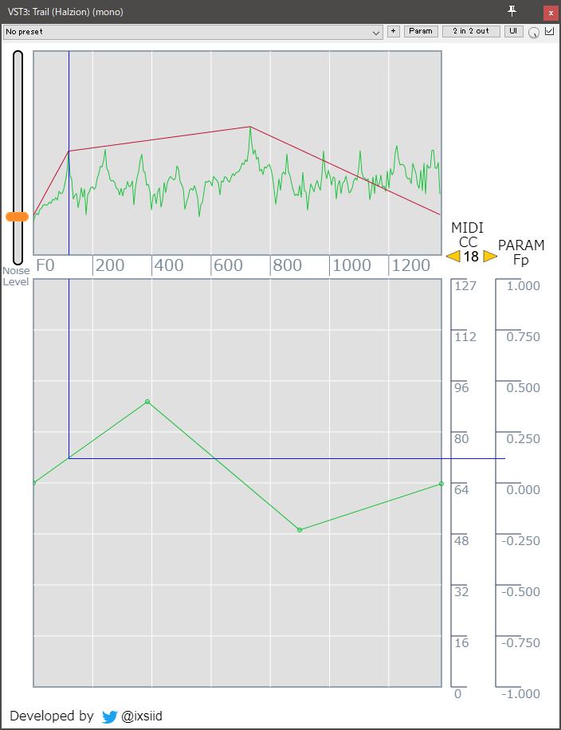

# Trail

入力された音声のF0推定して、パラメータとして出力するVSTプラグインです。
入力された音声は、そのまま出力音声としてバイパスされます。

# Getting Started

Trail.vst3ファイルをホストプログラム（多くの場合DAW）にインストールしてください。
Fxとして読み込むと次のようなGUIが表示されます。

上の波形は入力音声のスペクトルを表しています。

左上のオレンジ色のスライダーでノイズレベルを調整してください。
スクリーンショットのように、音声ピークの最も低周波が認識されてれいば適切です。

下の折れ線グラフは、F0値[Hz]をサイドチェイン用パラメータへの変換関数を表しています。
横軸から入力されたF0値（画面上部の周波数スペクトルから推定された値）を、
縦軸で表すMIDI CC値、または[-1, 1]に正規化されたパラメータFp値へと変換します。

折れ線のポイントはダブルクリックで追加、右クリックで削除できます。
各ポイントはドラッグ操作によって動かすことができます。

MIDI CC値の出力チャンネルは1で固定ですが、出力コントロール番号は画面右の黄色の左右ボタンにて変更できます。

###### 補足事項
* MIDI CCは旧システムとの互換用です。サイドチェイン操作そとしてはパラメータ値Fpを用いるほうが適切です。
* プラグイン単体の機能としては、各パラメータは自動保存されません。DAW側で保存操作を行ってください。(N敗)

# Deploy

このソフトはプラグインであり、別途VSTホストプログラム（多くの場合DAW）が必要です。
インストール方法は各VSTホストを参照してください。

# 動作確認

動作確認は、Reaper 64bit版にて行っています。
その他の環境での動作については随時ご連絡ください。

# Authors

ixsiid (https://halzion.net)

また、VST3プラグインの作成にあたって下記のページを参考にさせていただきました。

- [steinberg](https://www.steinberg.net/en/company/developers.html)
- [C++でVST作り](http://vstcpp.wpblog.jp/?page_id=1316)
- [Uhhyou](https://ryukau.github.io/VSTPlugins)

# License

MIT
